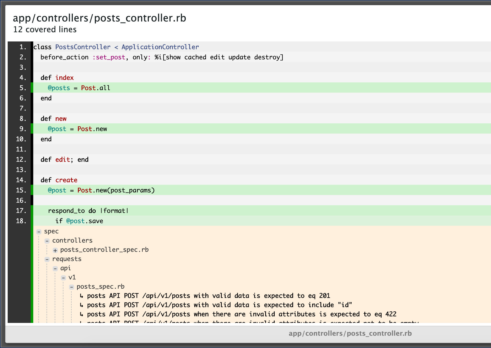

[](https://badge.fury.io/rb/reverse_coverage)

# ReverseCoverage

The goal of this component is to find what RSpec examples "cover" one or more lines of code of a Ruby project.

This is useful for example when you override methods of a parent product and you want to check what/how the specs treat the original lines.

## Installation

Add `gem 'reverse_coverage'` to your application's Gemfile and execute `bundle`.

Put the following code under you specs configuration:

```ruby
require 'reverse_coverage'

RSpec.configure do |config|
  config.before(:suite) do
    ReverseCoverage::Main.start
  end

  config.around do |e|
    e.run
    ReverseCoverage::Main.add(e)
  end

  config.after(:suite) do
    ReverseCoverage::Main.save_results
    coverage_matrix = ReverseCoverage::Main.coverage_matrix
    ReverseCoverage::Formatters::HTML::Formatter.new.format(coverage_matrix)
  end
end
```

## Usage

Run your specs, inspect the `'tmp/reverse_coverage.yml'` file or open `'tmp/index.html'` file.

To configure the base URL used to open a specific spec edit the generated `'tmp/settings.js'` file. Without changes, the default behavior is to open files locally.

## Options

- `file_filter`: allows to set a lambda to filter what files belongs to the project. Example (to add before `ReverseCoverage::Main.start` line): `ReverseCoverage::Main.config[:file_filter] = ->(file_path) { file_path.include? 'faked_project' }`

## Testing

Execute `bundle exec rspec` on the component root path, specs are based on an internal fake project.

## HTML output screenshot

Here it is a screenshot of the generated HTML interface:



## Contributing

Bug reports and pull requests are welcome on GitHub at https://github.com/nebulab/reverse_coverage. This project is intended to be a safe, welcoming space for collaboration, and contributors are expected to adhere to the [Contributor Covenant](http://contributor-covenant.org) code of conduct.

## License

ReverseCoverage is copyright © 2019 [Nebulab](http://nebulab.it/). It is free software, and may be redistributed under the terms specified in the [license](LICENSE.txt).

## About


ReverseCoverage is funded and maintained by the [Nebulab](http://nebulab.it/) team.

We firmly believe in the power of open-source. [Contact us](http://nebulab.it/contact-us/) if you like our work and you need help with your project design or development.
